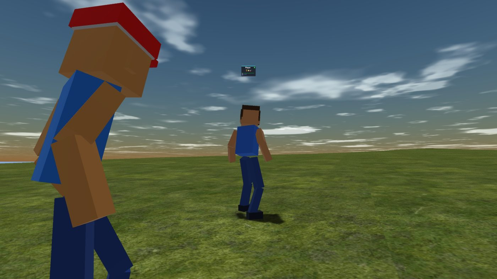

# WebGPU World — a shared 3-D world running on [GenosDB](https://genosdb.com)

[](https://estebanrfp.github.io/webgpu-world/)

### ▶ [Walk around it in your browser](https://estebanrfp.github.io/webgpu-world/)

*Chromium-based browser with WebGPU. Pick a name, and anyone else in the world sees you move. WASD to
move, Q to fly, walk into the sea to swim, `0`–`6` for the weather.*

**What this repository demonstrates** is a multiplayer world with **no game server**: players find
each other, see each other move and share the same island through **GenosDB** — a decentralized,
peer-to-peer graph database that talks over WebRTC. There is nothing to sign up for, nothing to
deploy and nothing storing your position. Open it on two machines and they are in the same world.

The world those players walk around is itself a second experiment: terrain, ocean, sky, weather,
animated avatars, an NPC crowd and physics, built **directly on the native WebGPU API**, with
hand-written WGSL and **no high-level 3-D engine** (no Three.js, Babylon or Orillusion).

> No install, no account, no backend, and every asset is served from this repo. The only thing on the
> wire is a signaling relay that introduces peers to each other; after that they talk directly.

## The GenosDB part

Multiplayer is usually the part that forces a backend on you: somewhere to authenticate, somewhere to
hold the session, somewhere to fan out positions. Here that somewhere is the other players.

- **Presence is ephemeral, deliberately.** Positions travel on `db.room.channel`, GenosDB's transient
  channel, and never enter the graph. A position is worthless two frames later, so there is nothing
  to persist, nothing to authorize and nothing to clean up. The graph is for state that must survive;
  this isn't it.
- **No Security Manager, no identity.** Walking around a world does not need a signed identity, so
  the database is opened with `rtc: true` and nothing else. The name you type is a label, not an
  account — which is why entering takes one field and no password.
- **The database name is the room.** `?room=<name>` on the URL opens a private world: peers only
  replicate with peers that opened the same name. It is also what gives the test suite a clean
  network on every run.
- **One channel, multiplexed.** Every peer broadcasts `{name, x, y, z, rotation, clip}` at 12 Hz on a
  single channel. Opening extra channels degrades the engine's own sync channel, so everything shares
  one.
- **It degrades to single-player.** No CDN, no relay, no WebRTC — the world still boots and plays.
  Presence returns an inert object and the render loop never knows the difference.
- **The engine is not bundled.** GenosDB is imported from the CDN at runtime, after the player
  enters, so it never competes with the textures during loading and never enters the build.

The whole networking layer is [`lib/network/presence.js`](lib/network/presence.js) — about 180 lines,
the only file in the project that knows GenosDB exists.

## Two worlds, two techniques

`webgpu-world` and [`orillusion-world`](https://github.com/estebanrfp/orillusion-world) are sibling
proofs of concept: the **same** idea — a browser-based 3-D virtual world with terrain/scene,
day-night, weather, ocean, animated avatars and NPCs — built **two different ways**, so the
approaches can be compared side by side.

- **[webgpu-world](https://github.com/estebanrfp/webgpu-world)** *(this repo)* — built directly on
  the **native WebGPU API**, hand-written WGSL, **no engine**.
- **[orillusion-world](https://github.com/estebanrfp/orillusion-world)** — the same kind of world
  built on the **[Orillusion](https://www.orillusion.com/)** WebGPU engine.

## What's in the world

- **Shared world, peer to peer** — pick a name on the way in and everyone in the same room sees you
  walk, run and swim, with your name above your head. No game server, no accounts, nothing persisted.
  Losing the connection costs you the other players, not the world.
- **One authored island** — the terrain comes from a single heightmap (`assets/heightmap.png`): a
  mountain ridge to the north-west, a closed bay to the east, sandy beaches and open sea all around.
  The player is kept near the origin so the world stays **finite and jitter-free without a Floating
  Origin system** — coordinates never get large enough to break Float32 precision.
- **Day/night + weather** — animated sky, three-layer clouds, rain / heavy rain / storm with
  lightning, snow, and ambient + footstep audio.
- **Ocean** — Gerstner waves, depth-based colour, caustics, foam, reflections, an underwater view, and
  an atmospheric horizon fade so the sea meets the sky cleanly.
- **Voxel avatars, built at runtime** — blocky characters meshed in JS from a compact parameter set
  and rigged to a Mixamo skeleton. **No external avatar service** (replaces the retired Ready Player
  Me dependency); every NPC is a deterministic, unique character.
- **Animation** — Mixamo clips (idle / walk / run / jump / fall) with crossfade blending, plus
  **swim / tread-water** for the sea and **floating** for flight.
- **NPC crowd** — dozens of avatars wander the island and **float/swim** when they reach deep water
  (they no longer fly).
- **Player traversal** — walk / run / sprint, jump, **fly (Q)**, and **swim**: you float when the
  water reaches your waist and swim when you move or dive.
- **GPU terrain physics** — the avatar walks *exactly* on the rendered ground (the visible mesh, the
  walkable ground and the water depth all share one height function).

## Getting started

```bash
pnpm install
pnpm dev
```

Open the URL Vite prints (defaults to http://localhost:3000/). Open it in two different browsers to
watch the P2P side work. Production build:

```bash
pnpm build
pnpm preview
```

## Controls

- **Move**: WASD · **Jump**: Space · **Sprint**: Shift
- **Fly**: **Q** (look up / down to ascend / descend)
- **Swim**: walk into the sea — you float when it reaches your waist and swim with WASD (S to dive)
- **Weather**: `0` clear · `1`–`2` clouds · `3` rain · `4` heavy · `5` storm · `6` snow
- **Camera**: mouse drag to orbit, scroll wheel to zoom
- **Private room**: add `?room=<name>` to the URL — only peers using the same room see each other

## How it works (notable techniques)

### Networking

- **A remote player is an NPC driven by the network** — peers reuse the NPC system's pipeline,
  uniform buffers and pre-created bind groups, so someone joining allocates nothing on the GPU. Their
  position arrives 12 times a second and is eased toward, which is why they move at 60 fps.
- **Slots, not allocations** — a fixed pool of remote-player slots is reserved at startup. A peer
  joining takes a free slot and swaps a few pointers; a peer leaving frees it. Their avatar is picked
  from a hash of their peer id, so it stays the same across rejoins without transmitting anything.
- **Nameplates keyed by slot** — not by peer id. GenosDB issues a fresh peer id per session, and the
  nameplate texture array never frees an index, so keying on the id would leak one texture per
  reconnection. The slot set is bounded, so it recycles.

### Rendering

- **Finite world, no Floating Origin** — rather than a camera-relative coordinate system, the player
  is clamped to a small region around the island, so positions stay small and precise. The terrain
  mesh follows the camera, but the island shape is fixed in world space.
- **One heightmap, five consumers** — the terrain vertex shader, the terrain shadow pass, the GPU
  physics compute, the CPU sampler (NPCs / camera) and the ocean's depth-foam logic all read the
  **same PNG**, so the rendered ground, the walkable ground and the water depth never disagree. The
  CPU half reproduces `textureSampleLevel` exactly — bilinear with texel centres at (i + 0.5) / size
  — because half a texel of drift is an avatar hovering over its own shadow.
- **Voxel avatars without a service** — characters are built from ~20 parameters and rigged to the
  Mixamo skeleton, so identity is a handful of bytes and never depends on a third-party API.
- **Animation correctness** — keyframe `alpha` is clamped to `[0,1]` so Mixamo clips that start at
  frame 1 don't extrapolate (and pop) for a few frames after each loop.
- **Frame cap by average rate** — the gap between animation frames is far too jittery to test
  directly (4–12 ms on a nominally 8.3 ms 120 Hz panel), so the loop draws whenever it is under the
  target *average* rate. A threshold on the gap settles on a lower harmonic instead: 45 fps when
  asked for 60.

## Project layout

```
webgpu-world/
├── index.html              # Main app: GPU setup, pipelines, render loop, entry dialog
├── lib/
│   ├── core/               # config.js (all tuning), WebGPU bootstrap, uniform writers
│   ├── network/            # P2P presence over GenosDB (loaded from the CDN, not bundled)
│   ├── shaders/            # WGSL modules (sky, terrain, ocean, character, shadow, weather)
│   ├── textures/           # Texture loaders (KTX2/Basis, image, procedural)
│   ├── avatar/             # GLB loader, voxel-builder, animation system + retargeting
│   ├── systems/            # character, npc, movement, weather, input, sound, daynight, nameplate
│   ├── geometry.js         # Plane / mesh generation
│   ├── lighting.js         # Day/night cycle: sun direction, light position, shadow projection
│   └── math.js             # Matrices, vectors, CPU heightmap sampler
├── assets/                 # Heightmap, textures, audio, character GLBs (rig + animations)
├── tests/                  # Playwright: two peers, one room
└── package.json
```

## Configuration

The room defaults to `webgpu-world` and is overridden with `?room=<name>`; everything else about the
P2P layer is a constant at the top of [`lib/network/presence.js`](lib/network/presence.js) —
broadcast rate, peer timeout, interpolation and the CDN URL of the engine.

The island itself is `assets/heightmap.png`, mapped by `CONFIG.heightmap`: `worldSize` is how many
world units the square map covers, and a texel's 0..255 becomes `minHeight … minHeight + heightRange`.
Those bounds are chosen so the existing biomes land where they should — sand at 15, grass at 35, rock
at 55, snow at 75, with the water line at 8. Sampling is clamp-to-edge, so past the map's border the
open sea carries on forever. The sampling expression is duplicated **identically** across
`terrain.wgsl.js`, `shadow.wgsl.js`, `oceanShader.wgsl.js` and `math.js` — change all four together.

Almost all other tuning lives in [`lib/core/config.js`](lib/core/config.js): island size & height,
water appearance, weather presets, movement and swimming, day/night timing, avatar look, audio.

`render.maxFPS` caps the frame rate at **60** by default. `requestAnimationFrame` fires at the
display's refresh rate, and drawing this world 120 times a second costs a lot of GPU for something you
cannot see while walking around an island — it is the difference between a warm laptop and a quiet one
when you leave the tab open. Set it to `0` to draw every animation frame.

## Requirements

- A Chromium-based browser with **WebGPU** (Chrome / Edge 113+).
- Node.js 18+ and pnpm (or npm / bun).

## Troubleshooting

- **WebGPU not supported** — update Chrome/Edge, or enable WebGPU in `chrome://flags` if needed.
- **Peers stay at 0** — the world still plays; presence needs WebRTC and a reachable signaling relay,
  and gives up quietly when it cannot get either. `[Presence]` lines in the console say what happened.
- **Two tabs of the same browser are not a test** — same-origin tabs share storage and
  `BroadcastChannel`, so "it synced" proves nothing about WebRTC. Use two different browsers, or the
  Playwright suite below.
- **Slow first load** — the first run downloads the bundled textures and audio (avatars are built in
  the browser — no model downloads).
- **No audio** — browser autoplay policies may require a click/keypress before sounds start.

## Tests

```bash
pnpm exec playwright install chromium   # once
pnpm test
```

The suite drives two peers through the entry dialog and checks that each one sees the other move —
and that it crossed WebRTC, by reading `getStats()` for a `candidate-pair` in state `succeeded` with
bytes on it, rather than trusting that the data simply appeared. Every peer runs in its own
`BrowserContext` and every test in its own room, because isolating storage does not isolate the
network: any peer still holding the old state would replicate it straight back into a "clean"
context, and the test would pass or fail on timing rather than logic.

## License

MIT — see [LICENSE](LICENSE).

## Author

Esteban Fuster Pozzi (@estebanrfp) - Full Stack JavaScript Developer
